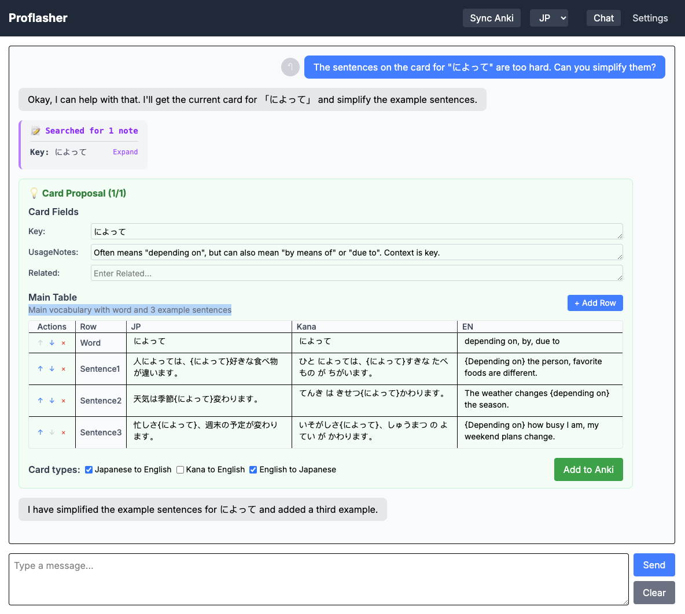

# Proflasher: AI-Powered Language Learning Flashcard Generator

<p align="center">
  
</p>

## Project Overview

Proflasher is an LLM assistant for creating language-specific Anki flashcards augmented with rich, AI-generated, level-appropriate information.

This is bundled with a rich card template, with the following features:
* Random choice from a selection of options for fields (e.g. cycling between verb forms or sentences)
* Reference tables
* Automatic and manual text-to-speech

## Screenshot

<p align="center">
  
</p>


## Requirements

* [Node.js](https://nodejs.org/en/download)
* [Anki](https://apps.ankiweb.net/)
* [AnkiConnect](https://ankiweb.net/shared/info/2055492159)
* That "power user" mindset that drove you to Anki instead of Duolingo.

## Setup

This setup creates new Anki note/card models, which will make Anki require an overwriting-upload next time you sync to AnkiWeb.
Before starting, sync Anki on all devices, then sync your computer, then save a backup of your database.

In a terminal, navigate to the directory you wish to install it into and clone the repository:

```bash
cd ~/Documents/
git clone https://github.com/LachlanStuart/proflasher.git
cd proflasher
```

Make copies of the example config file and example data directory.

```bash
cp proflasher/.env.example proflasher/.env
cp -R data.example data
```

At this stage you may wish to go through the files in `data/` and customize them, adding/modifying languages to suit your learning. See **Language Files** below for details.

You need to add a value for `LLM_API_KEY` to `proflasher/.env` to access Google Gemini. To get the key:
1. Go to [AI Studio](https://aistudio.google.com)
2. In the top right, click "Get API Key"
3. Click "+ Create API Key"
4. Hope it works. Sometimes it gives an error because the setup is still happening, and it suddenly starts working a few hours later.
5. Copy the key it gives you into the `proflasher/.env` file.

Run it with:
```bash
cd proflasher
npm install

npm run start
# or for a devserver:
npm run dev
```

It should give a URL to open in the browser - open it.
Go to the Settings screen (top-right).
Check all the Sync boxes and click Sync All Languages to build Decks/Note Types/Card Types for all configured languages.
Sync Anki manually through the Anki app, selecting "Upload to AnkiWeb".

## Language Files

The `data/` directory contains subdirectories for each language. Two-letter language codes are recommended for consistency.
You may add/remove languages by adding/deleting languages. See `data.example/` for example files.
Each language subdirectory contains several files that determine the card structure and prompt:

### prompt.md

This is how you tell the AI your preferences for card generation.
Use natural text to tell the AI about your current language level, what you want to focus on, etc.
When the AI does something wrong, you can use the chat to ask it what instructions in its prompt you need to change.

### note.yaml

This defines the structure for an Anki note type and its cards, and gives descriptions for all the fields for the AI.
It's YAML-formatted ([reference](https://yamline.com/tutorial/)).

The weirdest part about the card structure is the "tables".
These exist because I like my cards to be a mix of direct translations ("red" -> "rot") and sentence translations
("the car is red" -> "das Auto ist rot"), so every note has the data for both, and the card template randomly chooses between them each time it's shown.

The AI proposes tables in a grid, e.g.

|  | EN | DE |
|-----|----|----|
| Word | to be able to | können |
| Sentence1 | I can speak German | Ich kann Deutsch sprechen |
| Sentence2 | Can you help me? | Kannst du mir helfen? |
| Sentence3 | They can't come today | Sie können heute nicht kommen |

But Anki can't handle dynamically configured fields, so under the hood they're saved as semicolon-delimited lists like this:

| RowOrder | Word;Sentence1;Sentence2;Sentence3 |
| EN | to be able to;I can speak German;Can you help me?;They can't come today |
| DE | können;Ich kann Deutsch sprechen;Kannst du mir helfen?;Sie können heute nicht kommen |

The full tables are included on the back:


<p align="center">
  
  
</p>

There can be multiple tables per note type, which can be used for adding conjugation tables, etc. for quick reference.
Using [data.example/fr/note.yaml](/data.example/fr/note.yaml) as an example:

```yaml
# Metadata
noteType: FR<->EN
language: fr
deckName: Lang::FR

# Define the simple non-table Anki fields, with descriptions/instructions for the AI to follow
fieldDescriptions:
  Key: >
    Primary key for the card.
    Use the infinitive/neutral form of the word/phrase in French, as it would appear in a dictionary.
    If applicable and not overridden by the user, choose the masculine/singular/infinitive form.
    Suffix with (m) or (f) if applicable.
  UsageNotes: >
    Leave blank for straightforward words.
    May be used for usage notes for words when a word's usage or pragmatic tone differs from its English equivalent.
    May also be used for listing exceptional cases, e.g. how fressen is only used with animals.
  Related: >
    Related words (if any). Try to stay below 4 words.
    Include French and English, e.g. 'le chat (the cat); le chaton (the kitten)'
    Prioritize antonyms, common alternatives, and special word pairings such as verb+preposition and verb+noun combinations.
    This field may also be used for listing other items in common sets (e.g. seasons).

# List the fields that cannot be left blank. Should include non-table fields as well as table columns.
requiredFields: [Key, FR, EN]

# Groups of table columns. These will be rendered as separate tables on every card's back.
fieldGroups:
  - [FR, EN]
  - [ExtraFR, ExtraEN]

# Language codes for each field. This determines the voice used for speech synthesis.
fieldLangs:
  FR: fr
  EN: en
  ExtraFR: fr
  ExtraEN: en

# Define tables. The table named "main" is the one used for cards' front/back fields.
# Other tables are only for reference data that will show up on the back.
tableDefinitions:
  - name: main
    description: Main vocabulary with word and example sentences.
    columns: [FR, EN]
    columnDescriptions:
      FR: French text (words, phrases, or sentences)
      EN: English translation or equivalent
    rowDescriptions:
      Word: >
        The word/phrase.
        Only include a single form in FR. Include the minimum number of EN translations to give the gist of the word.
        For verbs, use infinitive form and prefix it with "to" in EN.
        For other word types, use the gender & number that was provided, or default to masculine/singular.
        Only include a (f) or (pl) suffix in English if it's relevant.
      Sentence1: First example sentence showing usage
      Sentence2: Second example sentence for context
      Sentence3: Third example sentence for variety
  - name: extra
    description: Optional conjugations for verbs or declinations for adjectives. Leave this empty for other word types.
    columns: [ExtraFR, ExtraEN]
    columnDescriptions:
      ExtraFR: French conjugations or declensions
      ExtraEN: English descriptions or translations of the forms
    rowDescriptions:
      Dict: (verbs only) Infinitive form e.g. 'faire/to do'
      1S: (verbs only) First-person singular present form e.g. 'je fais/I do'
      2S: (verbs only) Second-person singular present form e.g. 'tu fais/you do'
      3S: (verbs only) Third-person singular present form e.g. 'il fait/he does'
      3P: (verbs only) Third-person plural present form e.g. 'ils font/they do'
      Past: (verbs only) Past infinitive form e.g. 'avoir fait/to have done'
      PC1: (verbs only) First-person passé composé e.g. 'j'ai fait/I have done'
      PC3: (verbs only) Third-person passé composé e.g. 'il a fait/he has done'
      MS: (adjectives only) Masculine singular form, with hard-coded value in ExtraEN e.g. 'grand/M. Sg.'
      FS: (adjectives only) Feminine singular form, with hard-coded value in ExtraFR e.g. 'grande/F. Sg.'
      MP: (adjectives only) Masculine plural form, with hard-coded value in ExtraFR e.g. 'grands/M. Pl.'
      FP: (adjectives only) Feminine plural form, with hard-coded value in ExtraFR e.g. 'grandes/F. Pl.'

# Cards in Anki for this note. The description is shown in Proflasher for suspending/unsuspending a card type during creation
cardDescriptions:
  FR->EN: French to English
  EN->FR: English to French

# This determines the main content of the card.
# Each item under "rows" defines one row that appears on both the front and back.
# These render to the same HTML, but differentiate the front and back via CSS and logic in `card.js`. A lot is hard-coded. Sorry.
# To explain the below:
# - `flag: "flag-fr"`: This determines which "flag" to show next to the field. Flags are defined in CSS - see `style.css` below and the `card.css` global styles.
# - `field: "FR"`: Determines which field from Anki to show. All visible fields should belong to the same fieldGroup.
# - `attrs`: Extra HTML attributes for the element that will hold the field value:
# - `lang="fr"`: The language used for speech synthesis.
# - `class`: CSS classes to be applied to the language. The following classes are special:
#   - `prompt`: Shows on the front.
#   - `response`: Shows as "___" on the front, revealed on the back
#   - `speaknow`: When combined with `prompt` or `response`, it will be read aloud by the speech synthesis when the text is revealed.
#   - You can add custom CSS classes, e.g. the Chinese example adds a class `bigtext` to increase the font size of fields with Chinese characters.
cards:
  FR->EN:
    rows:
      - { flag: "flag-fr", field: "FR", attrs: 'lang="fr" class="prompt speaknow"' }
      - { flag: "flag-en", field: "EN", attrs: 'lang="en" class="response"' }
  EN->FR:
    rows:
      - { flag: "flag-en", field: "EN", attrs: 'lang="en" class="prompt"' }
      - { flag: "flag-fr", field: "FR", attrs: 'lang="fr" class="response speaknow"' }
```


### style.css

Contains flags and extra styles for the cards. This is language-specific.

For the global/default styles, check out [proflasher/lib/cardModel/card.css](proflasher/lib/cardModel/card.css).
